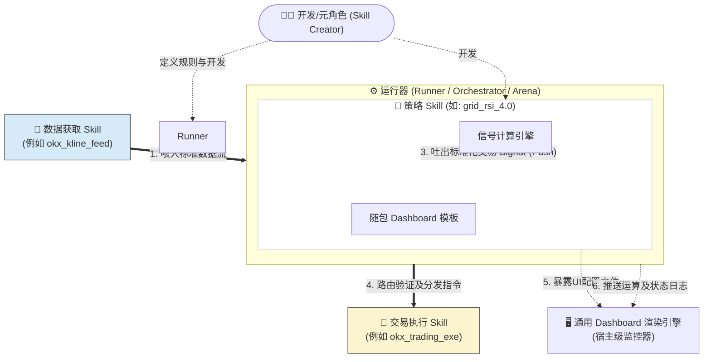

# ADR-002: Agentic Quant 技能生态与完备型 Skill 架构定义

> **状态**: 🟢 ACCEPTED
> **日期**: 2026-03-01

## 1. 背景与目标
在 `ADR-001` 中我们确立了核心能力剥离与解耦的底层设计。基于进一步的分析，我们认识到现代 Agentic Quant (基于智能体的量化交易) 开发范式正在发生根本性转变：即**将所有的交易组件视为“给 Agent 用的 EXE (可执行程序)”**。由于之前的解耦还未在功能层次的流转流中形成生态闭环，本 ADR 旨在正式定义 TradingSkills 生态圈中的四大核心角色及其流转机制，为后续所有策略的开发、测试与实盘运行提供顶层设计规范。

## 2. 核心理念：“Skill 作为给 Agent 用的 EXE”
在现代架构中，Skill 不再仅仅是一段 Python 脚本，而是一个高度标准化、可插拔的业务模块（宛如可执行程序 EXE）。
*   **说明书 (Manifest/SKILL.md)**：类似 EXE 的导出函数表或 JSON Schema，向大脑（大模型 Agent）声明该特定的 Skill 解决了什么问题、接收什么维度的参数。Agent 读了它才知道如何调度。
*   **运行代码 (Binary/Logic)**：黑盒内部的纯逻辑算法引擎。外层只关注输入后的规范化输出。

## 3. 完备型生态角色定义 (The Four Pillars)
为了实现极度串联 (Chaining) 和零成本复用回测，交易系统被拆分为以下四种可编排的元角色（Meta-Roles）：

### 3.1 策略 Skill (Strategy Skill - “计算大脑”)
*   **定位**：纯受体（Pure Component）及核心计算逻辑。绝不独立运行或主动拉取网路 API 交易数据。
*   **输入**：标准的结构化数据流（如 OHLCV 字典、资金状态），由外部投喂。
*   **输出**：标准化的 `Signal` 交易指令流（包含 Action, Price, Amount 等参数）。
*   **内置看板视角 (Dashboard Config)**：由于策略自己最清楚监控 KPI，策略包内自带可视化配置模板（如 `dashboard_config.json` 或 `view.html`）。它仅声明 UI 布局而绝不再包含绘图及网页渲染代码，交由外部系统展示。

### 3.2 运行器 (Runner / Orchestrator - “编排大管家”)
*   **定位**：连接各大 Skill 的中枢宿主 (Arena)。策略 Skill 必须挂载在 Runner 上才能发挥作用。
*   **职责**：
    1.  **调度拉取**：调用“数据获取 Skill”拿到所需行情，并按特定节奏（如定时、K线 Tick 级别）将其推入 (Push) “策略 Skill”。
    2.  **指令桥接**：接收“策略 Skill”分析后吐出的 `Signal` 信号，再路由或授权转发给外层的“执行器 Skill”。
*   **多场景宿主多态**：
    *   **实盘 Runner**：按真实时间流逝不断拉取交易所最新流，发起真实交易动作。
    *   **回测 Runner**：极速读取本地数据文件形成流，投喂策略，并拦截其发单指令进入本地虚拟撮合池中算盈亏。

### 3.3 数据获取 Skill (Data Feed Skill - “感知器官”)
*   **定位**：独立负责采集真实世界各种基础数据。
*   **职责**：它不具有任何交易算法。专门对接某个平台 API (如 OKX Kline / 链上 Node / Twitter 新闻情绪)。它输出经过滤及清洗的格式化数据供外部（ Runner 或别的 Agent ）按需直接拉取。

### 3.4 交易执行 Skill (Execution Skill - “执行手足”)
*   **定位**：唯一被授权发网络 API 请求，代表账户与外界交互的执行层（如现有的 `okx_trading_exe`）。
*   **职责**：接受来自 Runner 或中枢的单边标准 `Signal`，不带判断地将其翻译为特定交易所的具体请求或协议（发单、撤单、读取杠杆），并返回执行成功与否的日志。

## 4. 架构串联及数据流转图

## 5. 架构演进的深远影响
彻底剥离后的这套体系下，我们可以极大地加速策略迭代：
1.  **极智的复用与拼接**：做一条推特因子策略的人，再也不需要去写网路拉取或 OKX API，拿来即用。
2.  **绝对的安全沙箱**：策略开发时即使写入漏洞代码，由于在剥离框架下它本身不可直接触网，杜绝了发恶意实盘挂单的可能性（仅被授权的 Runner+Exe 组合才能向外请求）。
3.  **开发角色专精**：工程师的角色可以高度平行运作。写 Dashboard 的专心写监控壳框架，写因子策略的闭门算法，大家在各自文件夹用 `SKILL.md` 语言达成连接契约。

